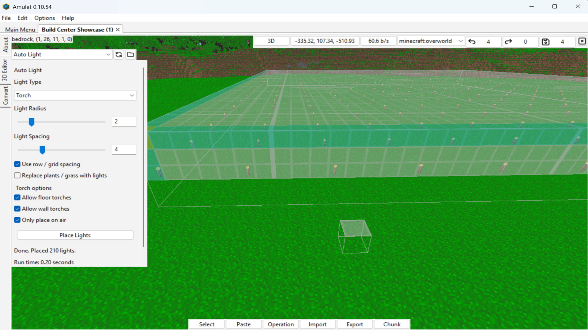
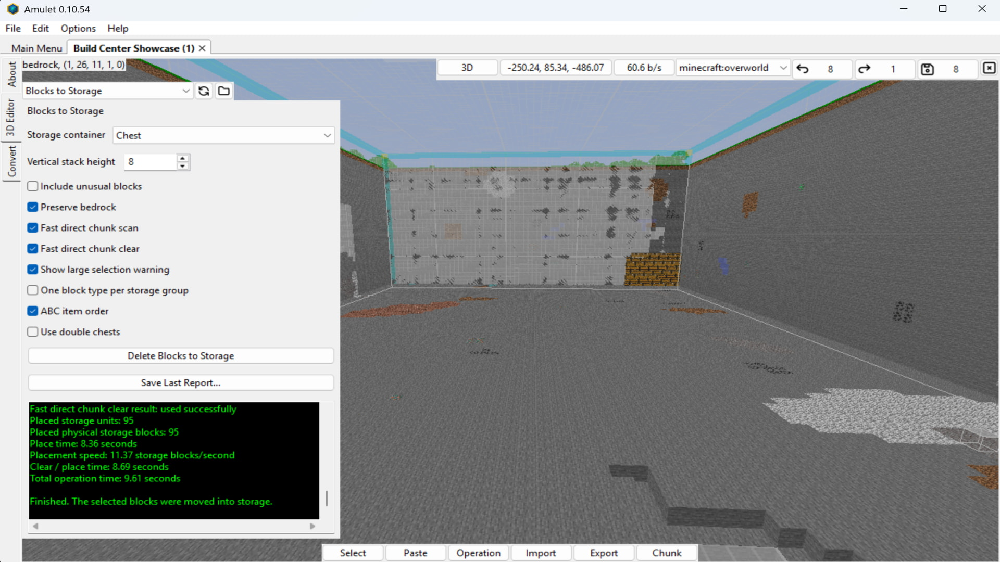

# Amulet Utility Plugins

A collection of free utility plugins for Amulet Map Editor, focused on Minecraft Bedrock Edition world editing, automation, cleanup, and quality-of-life tools.

These plugins are made for practical editing workflows. Some tools may be niche or built for specific edge cases, but each one is designed to save time, reduce repetitive work, or make certain Amulet editing tasks easier to manage.

Whether you are a map creator, builder, technical player, tester, or someone cleaning up a world, these plugins are meant to help with problems that can be tedious, time-consuming, or awkward to handle manually in Amulet or in-game.

If this repository does not currently have a tool for the problem you are trying to solve, feedback and feature requests are welcome. Useful ideas may be considered for future plugins or updates.


## Current Plugins

### Auto Light

Auto Light helps place light sources in dark areas of a selected Minecraft Bedrock Edition world region.

It is intended to reduce the amount of manual lighting work needed in caves, builds, underground areas, surface areas, farms, tunnels, and other spaces where visibility or hostile mob spawning may be a concern.

This can be useful for map cleanup, spawn-proofing, build preparation, testing areas, or quickly improving lighting across larger selected regions.

### Blocks to Storage

Blocks to Storage collects blocks from a selected Minecraft Bedrock Edition world region and organizes them into supported storage containers.

It is intended for cleanup, testing worlds, large edits, resource recovery, and situations where blocks need to be collected, sorted, or stored instead of manually handled or permanently deleted.

This can be useful when clearing large areas, preserving materials from edits, organizing block counts, or converting selected world regions into storage-friendly outputs.


## Screenshots

Preview screenshots are available in the `Media` folder.

### Auto Light



More Auto Light screenshots: [`Media/Auto-Light`](Media/Auto-Light)

### Blocks to Storage



More Blocks to Storage screenshots: [`Media/Blocks-to-Storage`](Media/Blocks-to-Storage)

## Installation (Windows)

1. Download the plugin file you want to use.
2. Move the file into:
```
%LOCALAPPDATA%\AmuletTeam\AmuletMapEditor\plugins\operations
```
3. Restart Amulet Editor.
4. Open the Operations tab.
5. Refresh plugins if needed.

If the folders do not exist yet, create them manually.


## Cost

These plugins are free from the original maintainer. Donations may be accepted, but there is no required payment or forced paywall.

## Official Source

The official source for this project is the [Amulet Utility Plugins GitHub repository](https://github.com/ZeroTraceAPI/Amulet-Utility-Plugins).

If you share, fork, modify, package, or redistribute these plugins, please link back to the official source so users can find a clean and current copy.

## Contributing

Contributions are welcome. This includes bug reports, feature requests, new ideas, testing notes, documentation improvements, and code changes.

Before contributing, please read [`CONTRIBUTING.md`](CONTRIBUTING.md) so you understand the project rules, contribution terms, review process, and licensing expectations.

## Contact

For normal questions, bug reports, feature requests, and public discussion, please use GitHub Issues or GitHub Discussions when possible.

If you do not want to create a GitHub account, you can contact the maintainer by email:

`ZeroTraceAPI@proton.me`

Please include the plugin name, plugin version, Amulet version, Minecraft Bedrock version, and a clear description of the issue or question when relevant.

Email support is not guaranteed, but reasonable project-related messages are welcome.
